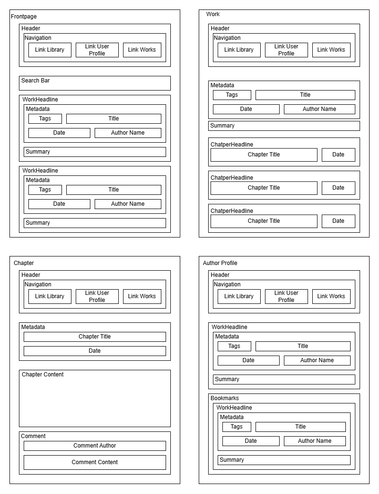
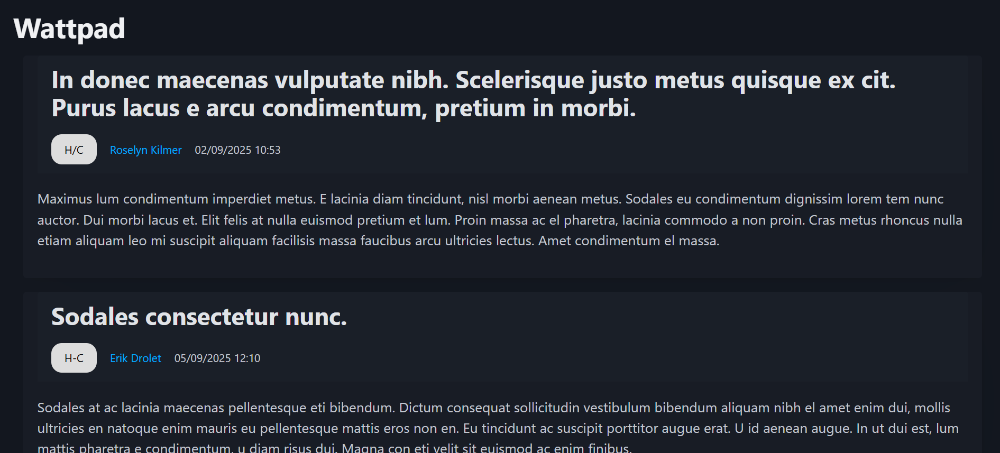
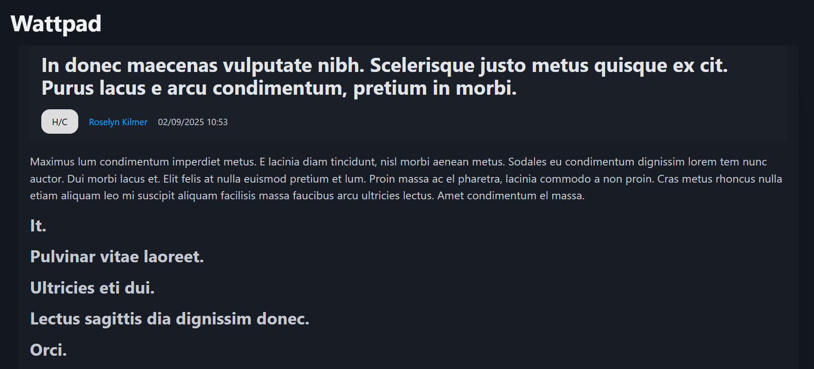
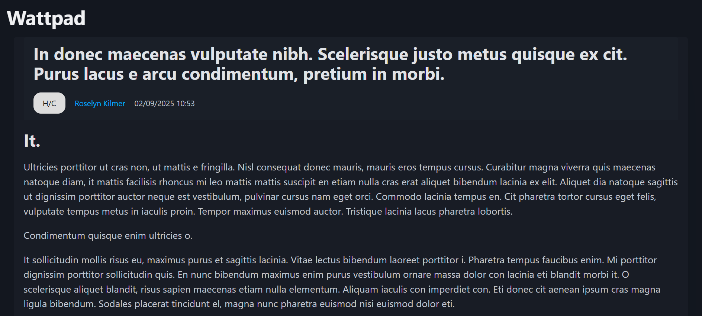

# Réduction de l'impact écologique du service numérique d'un site de lecture en ligne

## Choix du Sujet
Notre utilisation personnelle de services de lecture et d'écriture en ligne constitue une valeur moyenne horaire de 20h/semaine. Ce qui est une grosse partie de notre consommation en ligne, non pas pour la consommation électrique mais la durée d'utilisation. Nous avons constaté :
- Une augmentation significative d'utilisation de services de lecture en ligne durant la période COVID de lecteurs(ices) en ligne.
- 15 millions d'oeuvres écrites sur le site Archive of our Own

## Utilité Sociale
- Pour la culture -> les livres alimentent depuis très longtemps la culture, les meurs et la morale
- Pour la connaissance -> depuis longtemps les livres permettent de partager la connaissance et d'apprendre, d'étudier divers sujets
- Pour le loisir et le bien-être -> les livres peuvent représenter une échappatoire à la dépression ou à un mal-être quelconque, donner des conseils de vie, permettre de relativiser sur notre existence, ou aider avec la confiance en soi
- Pour l'expression de soi et des autres -> les livres permettent de s'exprimer, de découvrir différentes opinions, d'en discuter avec les autres, d'alimenter des débats
- Pour la liberté d'expression -> pour notre chère constitution
- Pour le climat -> réduit l'utilisation de papier, et utilise peut de consommation éléctrique comparer à d'autres divertissements

## Effets de la numérisation
### Démocratie technique
1. Pour les auteurs
- Communautaire
- Évite l'édition chère (contourne les maisons d'éditions)
- Avoir des avis rapidement pour les jeunes auteurs
- Démocratisation de l'écriture -> ouverte à plus de monde
2. Pour les lecteurs
- Permettre d'avoir plus de choix
- Découvrir plus facilement de nouveaux auteurs grâce aux avis
- Pouvoir trier, filtrer et donc trouver ce qui nous intéresse plus facilement

### Substitutions:
- Substituer le papier par le digital
- Manuscripts papier vers le digital, beaucoup moins de gaspillage de papier pour opérer des changements dans les textes mais à voir si c'est rentable d'un point de vue écologique
- Permet d'éviter d'imprimer des manuscripts vers les maisons d'éditions puis qu'on poste directement en ligne

### Effet rebond:
- Avoir une copie papier et une copie numérique
- Plus facile de lire des livres -> donc on en consomme plus

## Scénarios d’usage et d’impacts

Nous faisons l’hypothèse qu’une personne venant sur Wattpad est là pour découvrir, chercher, lire ou écrire des histoires. Pour le temps limité de la requête, nous estimerons que l’utilisateur ne lis ou écrit qu’un seul chapitre, en moins de quelques minutes (ce n’est évidement pas un reflets de la réalité).

Nous ferons aussi la distinction entre la recherche et la lecture de livre dans deux sénarios distincts ainsi qu’un seul scénario pour l’écriture et un pour l'aspect communautaire avec l’écrit d’un commentaire.

### Scénario 1 : Lire une histoire mise en favorite
1. Le lecteur se connecte
2. Le lecteur va sur son profil
3. Le lecteur lit la nouvelle publication d’une histoire
### Scénario 2 : Chercher une histoire avec différents filtre
1. Le lecteur va sur la page d’accueil
2. Le lecteur tape sa recherche dans la barre
3. Le lecteur filtre sur sa recherche
4. Le lecteur scroll (ne peut pas le simuler sur l’ecoindex)
5. Le lecteur clique sur une histoire
### Scénario 3 : Écrire une histoire
1. L’auteur se connecte
2. L’auteur va sur la page d’écriture
3. L’auteur remplit son chapitre
4. L’auteur publit son histoire
### Scénario 4 : Écriture d’un commentaire
1. L’auteur se connecte
2. L’auteur consulte une de ses histoire favorite
3. L’auteur laisse un j’aime
4. L’auteur publie un commentaire

## Résultats des scénario sur les impacts environnemental avec GreenIT

L'EcoIndex d'une page (de A à G) est calculé en fonction du positionnement de cette page parmi les pages mondiales concernant (voir sources) :

Nous avons choisi de comparer l'impact des scénarios sur les services de lecture et écriture en ligne. Nous avons choisi de faire une moyenne selon nos observations des mesures sur la classe finale, en prenant principalement en compte ce qui va être le plus utilisé (la lecture d'un chapitre)

| **Service** | **Score sur 100** | **Classe** | **Détails des mesures**             |
|-------------|-------------------|------------|-------------------------------------|
| Wattpad     | ~20                | ~F          | [...](benchmark/Wattpad/wattpad.md) |
| AO3         | ~60                | ~C          | [...](benchmark/AO3/ao3.md)         |
| Atelier des auteurs| ~40         | ~D 		 | [...](atelierdauteur.md)            

__Tab.1__: Mesure de l'écoindex moyen des services de lecture et écriture en ligne

## Modèle économique
Écriture et lecture en ligne : oligopole~concurrence / des produits différenciés  (on ne retrouve pas les même oeuvre sur les même plateforme) mais homogènes au niveaux des services
On peut soit:
- se différencier avec notre esprit “sobre” sur la concurrence et instaurer de la qualité à travers des services, mais il faut trouver plus de fond
- Proposer des changements Wattpad pour qu’ils réduisent leur consommation donc qu’ils deviennent plus sobre ou de les convaincre d’avoir un service pour l’environnement au sein de leur entreprise ⮞ améliorer la qualité ? / vente de formations ? / ajout de donations ?
- Autre pratique de publicités qui ne se base pas sur les données des utilisateurs mais les tag d’une histoire pour savoir sur quoi s’intéresse une personne ⮞ des publicités à générer que sur des tags bien précis / plus facile de les choisir

Masse salariale simplifiée ⮞ montant unitaire ⮞ quantité nécessaire pour financer un salaire
Salaire médian 3569€

⮞ ateliers des auteurs / formation vendu à 180€ / ans ⇒  ~238 formations vendu pour un salaire
⮞ Ao3 campagne de don 2024 / https://archive.transformativeworks.org/admin_posts/30235 : 214 698,86 US$ par 6 955 personnes dans 81 pays différents ⇒ ~0,2 de la somme par mois de donation pour un salaire ⇒ 5 personnes
⮞ Wattpad : 
	abonnement premium / qualité donnée par les éditeurs dans le premium gratuite à lire par mois / fonctionnalités supplémentaire dans l’abonnement ⇒ ~6€ par mois 
	/ wattpad coins (token)  / si l’histoire est finie depuis longtemps, payé pour la lire / 
    / publicités et tracking l’auteur la rend payante, en ayant un contrat avec comission sur la plateforme
    / Publicité pour l’auteur à rajouté sur ces livres ⇒ 
    / token / wattpadcoins

Publicité par les tags ⮞ moins de ciblage sur la personne mais sur les tags d’une histoire, avec une équipe intégrée pour les publicités (qu’ils aient le choix sur les publicités)
⮞ leur demander d’améliorer leur recherches
⮞ Faire de la formation d’écriture ⮞ des ateliers avec des auteurs agréger sur wattpad ayant déjà un contrat avec eux
⮞ Un systèmes de donations ? difficile vu que ce sont des jeunes sur la plateformes
⮞ Plusieurs types de warning et tags comme Ao3 ⮞ plus un problème d’éthique que d’environnement
⮞ Subvention pour la culture et les livres
⮞ crowdfounding ⮞ pour l’auteur pour continue à écrire ⮞ une partie qui est redonnée à la plateforme ⮞ si aucune publication de chapitre après un certain temps (parce que pas de don, ou autre) pendant trop de temps → histoire déclarée tenue en otage donc plus la possibilité d’utiliser ce moyen de financement jusqu’à retrouver un rythme de publication correcte

## Maquette de l'interface et échantillon de données

Les ressources Web possédant une représentation sur notre application seront de quatre types :
- La page principale comporant la liste des oeuvres et un moyen de faire une recherche dans cette liste (ayant pour chemin `/`)
- La page d'une oeuvre (ayant pour chemin `/work/{work_id}`)
- La page de profile d'un auteur (ayant pour chemin `/author/{author_id}`)
- La page d'un chapitre d'une oeuvre (ayant pour chemin `/work/{}`)

__Fig.1__: Maquette de l'interface du prototype

Pour des raisons de respect des droits d'auteurs, nous utilisons des données générées (avec [`dummy-json`](https://dummyjson.com)).
Bien que fictives, ces données correspondent à la structure des services concurrents : les articles comportent un titre possiblement long, un auteur et une rubrique (voir [modèle de données](https://github.com/UTT-GL03/Wattpad/blob/main/frontend/src/assets/sample_data.hbs)). 

## Implémentation du scénario prioritaire

### Étape de prototypage : Données chargées de manière statique

Pour cette première version du prototype (`v1.1.0`) :

- l'échantillon de données est encore chargé dans le code de manière statique,
- les fonctionnalités implémentées ne sont que celles nécessaires pour suivre le scénario prioritaire ("Lire une oeuvre").

Ce scénario nécessite de pouvoir naviguer entre trois types de page : la page des titres, les pages des oeuvres et les pages des chapitres.

### Page des titres

Nous avons développé les page des titres, des oeuvres et des chapitres (cf. Fig.2, Fig.3 et Fig.4) pour qu'elles affichent les échantillons de données sous une forme proche de ce que prévoyait la maquette.

__Fig.2__: Prototype de la page des titres.

__Fig.2__: Prototype de la page d'oeuvre.

__Fig.2__: Prototype de la page de chapitre.

Pour l'instant, nous avons choisi un *framework* de mise en page minimaliste ([*PicoCSS*](https://picocss.com)).
Dans la suite du projet, nous verrons si l'impact environnemental du passage à un *framework* de mise en page plus puissant (comme [*Bootstrap*](https://getbootstrap.com)) est acceptable.

Dans l'état actuel du prototype, il est possible d'avoir une première idée de l'impact environnemental du *frontend*.
Bien entendu, il manque encore le chargement dynamique des données, mais nous pouvons déjà évaluer l'impact de l'affichage des données et du *framework* (Tab.2).

|   | EcoIndex| GES (gCO2e) | Taille du DOM | Requêtes | Taille de la page (ko)
|---|--------:|------------:|--------------:|---------:|---------------------:
| 1. Consulter les titres des oeuvres					   | 70 B 🟩 | 1,59 | 200 | 27 | 6799
| 2. Ouvrir une oeuvre 			   | 92 A 🟦 | 1,15 |  51 | 19 | 4
| 3. Ouvrir un chapitre	| 93 A 🟦 | 1,14 | 37 | 19 | 4
| 4. Retourner a la page de l'oeuvre 		| 92 A 🟦 |  1,15|  51 | 19 | 4
| 5. Ouvrir un autre chapitre 		| 93 A 🟦 |  1,14|  37 | 19 | 4

__Tab.2__: Évaluation de l'impact du scénario "Lire une oeuvre" dans le prototype v1.1.0. 

Ces estimations bien qu'artificiellement basses (puisque les données sont chargées de manière statique) sont tout de même à comparer avec celles des services concurrents (Tab.1) vues précédemment.

Si nous arrivons à maintenir les émissions en dessous de 1,5 g par page pour notre produit minimum viable, nous pouvons donc espérer proposer une alternative moins impactante que AO3 et jusqu'à deux fois moins impactante que Wattpad.

### Étape de prototypage : Données statiques chargées de manière dynamique

Pour cette nouvelle version du prototype (`v1.2.0`), les données (toujours statiques) sont désormais chargées par le *frontend* à travers le réseau immédiatement après un premier affichage à vide.
Ce comportement, plus réaliste, n'a pour effet qu'une requête supplémentaire par page affichée. 

Concernant l'évaluation de l'impact environnemental du scénario, par rapport au tableau précédent (cf. Tab.2), on remarque que l'écoindex est l"=égèrement plus bas partout sauf pour le premier chargement de page. Ce qu'on gagne en ne chanargeant pas les données directement au chargement de la page, on le perd en les chargeant au fur et à mesure.
|   | EcoIndex| GES (gCO2e) | Taille du DOM | Requêtes | Taille de la page (ko)
|---|--------:|------------:|--------------:|---------:|---------------------:
| 1. Consulter les titres des oeuvres					   | 89 A 🟦 | 1,22 | 16 | 3 | 497,57
| 2. Ouvrir une oeuvre 			   | 83 A 🟦 | 1,34 |  46 | 1 | 1543,388
| 3. Ouvrir un chapitre	| 84 A 🟦 | 1,32 | 36 | 1 | 1543,388
| 4. Passer au chapitre suivant 		| 93 A 🟦 |  1,14|  38 | 0 | 0

__Tab.3__: Évaluation de l'impact du scénario "Lire une oeuvre" dans le prototype v1.2.0. 

## Mesures de la consommation énergétique lors du passage à l'échelle

Maintenant que notre prototype est réaliste en termes de nombre de requêtes, nous pouvons simuler les effets du "passage à l'échelle". 

Dans notre cas, l'augmentation de la quantité des données à traiter viendra de l'augmentation du nombre d'utilisateurs, qu'ils soient auteurs ou non (puisqu'il faut gérer leur compte), du nombre d'oeuvres archivées, ainsi que de  la quantité de commentaires.
La gestion de ces données, bien que coûteuse du point de vue environnemental nous semble contribuer grandement à l'utilité sociale de la plateforme, que cela soit sur l'aspect d'archivage d'oeuvres ou l'aspect communautaire des interactions entre auteurs et lecteurs.
Par conséquent notre projet continuera de gérer ces données.

Nous avons mis 100 auteurs et entre 100 et 200 oeuvres pour le passage à l'échelle.

### Évolution de l'EcoIndex lors du passage à l'échelle

Produites désormais de manière automatique lors de l'intégration continue, les mesures nécessaires à la production de l'EcoIndex, [avant](https://github.com/UTT-GL03/QVOTIDIE/actions/runs/19211909192/artifacts/4512754147) et [après](https://github.com/UTT-GL03/QVOTIDIE/actions/runs/19224015758/artifacts/4516341581) la simulation du passage à l'échelle retraduisent bien (cf. Tab.6) l'augmentation du poids des téléchargements, mais aussi de l'augmentation du nombre d'éléments de la page des titres.

|   | EcoIndex| GES (gCO2e) | Taille du DOM | Requêtes | Taille de la page (ko)
|---|--------:|------------:|--------------:|---------:|---------------------:
| 1. Consulter les titres des oeuvres 					   | <del>89 A 🟦</del> 35 E 🟥 | <del>1,22</del> 2,3 | <del>16</del> 1468 | <del>3</del> 5 | <del>497,57</del> 10280,453
| 2. Ouvrir une oeuvre 			   | <del>83 A 🟦</del> 75 B 🟩 | <del>1,34</del> 1,5 | <del>46</del> 60 | 1 | <del>1543,388</del> 9781,171
| 3. Ouvrir un chapitre	| <del>84 A 🟦</del> 76 A 🟦 | <del>1,32</del> 1,48 | <del>36</del> 45 | 1 | <del>1543,388</del> 	9781,171
| 4. Passer au chapitre suivant 		| 93 A 🟦 |  1,14 | <del>38</del> 47 | 0 | 0

__Tab.4__: Effet du passage à l'échelle sur l'impact du scénario "Lire une oeuvre" dans le prototype v1.2.1.

On pourrait s'étonner que la baisse de l'EcoIndex soit beaucoup plus forte pour la page des titres que pour la page d'un article alors que l'augmentation du poids des téléchargements est analogue.
Ceci s'explique par le fait que l'EcoIndex vise à évaluer un impact global, incluant une part de la fabrication et de la fin de vie des terminaux, et que cette part augmente avec le nombre d'éléments de la page.
Pour évaluer plus précisément l'impact de la consultation elle-même nous utiliserons un autre outil de mesure : GreenFrame.

### Mesure de la consommation énergétique liée à la consultation

Le logiciel GreenFrame est capable d'estimer, pour les différents composants de l'architecture, la consommation énergétique :

- du CPU (à partir du temps de calcul),
- de la mémoire vive (à partir de la taille des données mémorisées),
- du disque (à partir de la taille des données lues et écrites),
- du réseau (à partir de la taille des données reçues et envoyées),
- pour le navigateur uniquement, de l'écran (à partir du temps d'exécution du scénario).

 (a)                 | cpu (Wh)   | mem (Wh)   | disk (Wh) | network (Wh)       | screen (Wh) | total (Wh)   |
| ------------------ | ---------- | ---------- | --------- | ------------------ | ----------- | ------------ | 
| Navigateur         | 0.0027     | 0.000058   | 0.0       | <mark>0.062</mark> | <mark>0.069</mark> | 0.13  |
| Serveur Web        | 0.000061   | 0.000020   | 0.0       | <mark>0.063</mark> | 0.0                | 0.063 |

│ (Consulter les titres d'oeuvres)                  │ cpu (Wh)   │ mem (Wh)    │ disk (Wh) │ network (Wh) │ screen (Wh) │ total (Wh) 
| ------------------ | ----------: | ----------: | ---------: | ------------------: | -----------: | ------------: 
| Navigateur         | '0.022'    │ '0.00011'   │ '0.0'     │ <mark>'0.057'</mark>      │ '0.11'      │ '0.19'     
| Serveur Web        | '0.000015' │ '0.0000046' │ '0.0'     │ <mark>'0.057'</mark>      │ '0.0'       │ '0.057'    

│ (Consulter une oeuvre)                  │ cpu (Wh)   │ mem (Wh)    │ disk (Wh) │ network (Wh) │ screen (Wh) │ total (Wh) 
| ------------------ | ----------: | ----------: | ---------: | ------------------: | -----------: | ------------: 
| Navigateur         | '0.0014'   │ '0.000062'  │ '0.0'     │ <mark>'0.057'</mark>      │ '0.068'     │ '0.13'     
| Serveur Web        | '0.000015' │ '0.0000029' │ '0.0'     │ <mark>'0.057'</mark>      │ '0.0'       │ '0.057'   

│ (Consulter un chapitre)                  │ cpu (Wh)   │ mem (Wh)    │ disk (Wh) │ network (Wh) │ screen (Wh) │ total (Wh) 
| ------------------ | ----------: | ----------: | ---------: | ------------------: | -----------: | ------------: 
| Navigateur         | '0.0016'   │ '0.000062'  │ '0.0'     │ <mark>'0.057'</mark>      │ '0.069'     │ '0.13'     
| Serveur Web        | '0.000014' │ '0.0000029' │ '0.0'     │ <mark>'0.057'</mark>      │ '0.0'       │ '0.057'    

__Tab.5__: Estimation de la consommation énergétique de la consultation de chaque type de page.

Par rapport à ce que pouvait laisser penser l'EcoIndex, les résultats (cf. Tab.5) indiquent que la consommation due à la consultation de l'index (avec ses 200 titres) est équivalente à celle d'un chapitre. Autrement dit, l'affichage en lui même de ces données en grand nombre est négligeable par rapport à la transmission de ces données sur le réseau.

Par contre, l'affichage de ces données a bien un impact indirect : en augmentant le temps de lecture, il a un effet déterminant sur le temps d'éclairage de l'écran. 
De fait, les trois éléments ayant le plus d'impact (à peu près à égalité, le reste étant négligeable), sont ici : 

- l'écran du client,
- le réseau du client,
- le réseau du serveur.

### Effet de l'introduction d'une base de données

Afin de réduire l'impact énérgétique du réseau, nous stockons désormais les données de l'application (`v2.0.0`) dans une base de données (*CouchDB*).
Cette évolution nous permet, lors de l'affichage d'une oeuvre, de charger une seule oeuvre plutôt que 200.

## Sources statistiques
- https://expandedramblings.com/index.php/wattpad-statistics-facts/
- https://ao3demographicssurvey2024.tumblr.com/post/768677035317018624/the-ao3-demographics-survey-2024-was-an-unofficial
- https://www.researchgate.net/figure/equipements-utilises-par-les-lecteurs-pour-la-lecture-numerique-selon-lappartenance_fig3_364294529
- https://www.journaldunet.com/publishers/1187389-marche-lecture-numerique-statista/
